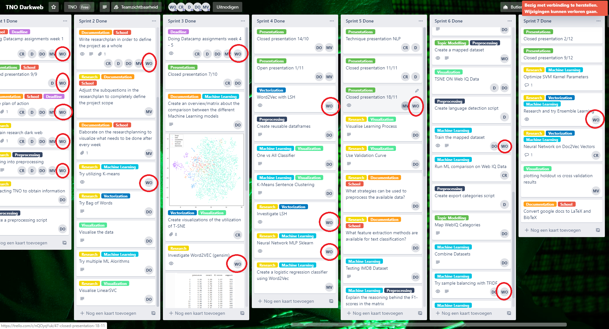

# Portfolio

## Domain knowledge
### Introduction of the subject field
The project me and my group members have been working on has been creating a darkweb text classifier that can classify text to interpol topics.
The darkweb is a part of the deepweb, which is the part of the internet that has not been indexed and therefore not shown in the output of any search engine query.
To gather text data in a place you cant search for TNO, the company we created this classifier for, has tasked WebIQ to scrape the dark web for data using a web crawler. This text data has been used to create the dark web text classifier.

### Literature research
To understand the problem domain I first did some literature research on the darkweb, later I also visited the darkweb myself to see what it looked like and how it worked.
After gaining understanding about the prolem domain I researched the field of Natural Language Processing.
During this research I have gained experience and knowledge about:

- Preprocessing text data
- Translating text data into numerical vectors
- Using various machine learning models to train on these vectors

### Explanation of Terminology, jargon and definitions
[Terminology list a group member created, but the team later contributed to.](./Terminology.pdf)
## Reflection

- [Reflection on own contribution to the project.](./reflection_own_project_contribution.md) 
- [Reflection on own learning objectives.](./reflection_own_learning_objectives.md)
- [Evaluation on the group project as a whole.](./evaluation_group_project.md) 

## Research project

### Task definition
In this project I mostly constributed to the following research questions:

##### What labels of the dataset provided by TNO are relevant for the research?
It was concluded that all labels were relevant but were not in the correct format, I have created a [script to map the Agora and Web-IQ dataset labels to interpol topics. ](./Notebooks/maptointerpoltopics.ipynb) 

##### What feature extraction methods are available for text classification?
For this project I have used methods like Word2Vec and Fasttext to extract features and vectorize our text data.

##### What machine learning algorithms can be used for natural language processing?
There are various machine learning algorithms that can be used for natural language processing, in [this Ensemble learning notebook ](./Notebooks/Ensemble_Learning.ipynb) I have used 6 different machine learning momdels, 6 different ways to vectorize text data and 5 different preprocessing methods.

##### What machine learning algorithms give the best result?
The best results I have achieved this project was with my Ensemble learning model, which scored around 95% accuracy on the Agora dataset.

##### What combination of processing, feature extraction and machine learning algorithms gives the best pipeline?
The best possible pipline that was created during this project was with minimal preprocessing, TF-IDF vectorization and a Linear SVC model.
In [this notebook ](./Notebooks/model_comparison.ipynb) I have used this method on both the Agora dataset and the WebIQ dataset.

### Evaluation
The goal for this project was to create a dark web topic classifier, although we did succeed in creating this classifier I felt that there is still a lot to to before this classifier can be used for the purpose TNO wants to use it for. Because we were limited by the quallity of the data TNO provided us there were certain hurdles impossible to overcome. The classifier we created can still be used to classify the few topics that did occur in the provided data and does this quite accurately. In the end both the project team and TNO were satisfied with the results.

For future work the most important task would be obtaining more and of higher quality data to be able to classify more topics more accurately.

### Conclusions
In [this notebook ](./Notebooks/model_comparison.ipynb) the results of training a Linear SVC model with tfidf vectors and minimal stripping are show.
I conclude that the results on the Agora dataset were a lot higher than on the WebIQ dataset because of 2 reasons:
- The WebIQ sentences are long, which causes more variety and are harder to predict correctly.
- The Agora dataset has a stronger bias towards drugs which makes predicting drugs really easy.

### Planning 
The global planning we made in the beginning of the project:

We used SCRUM as a development method and used trello to create a scrumboard to keep track of all the tasks. In this screenshots I have marked all the tasks completed by me.

## Predictive analysis
### Selecting a Model
I have researched and used a lot of machine learning models but the most work was put into optimizing [this Ensemble learning notebook. ](./Notebooks/Ensemble_Learning.ipynb).
In a meeting with TNO I proposed this method of machine learning, I got the idea of ensemble learning by experimenting, after reading some articles and papers i learned that this is an accepted method of machine learning. 

### Configuring a Model
When configuring a model, in the Ensemble learning example above I have used the standard parameters for all used machine learning models because it did not improve results when trying out different parameters.

I also tried tweaking the parameters on a sklearn neural network (before we knew that we shouldnt use it.) and on this model the results did improve by a lot, but this is quite logical since changing parameters means more layers or neurons in each layer and this will change the results by quite a bit.

### Training a model
One of the reasons I have tried Ensemble learning is because it can help against under- or overfitting. When using an ensemble of machine learning models it will smooth out the predictions of multiple models and by doing this it reduces the effects of an under- or overfitted model.

### Evaluating a model
In most of my notebooks I have used cross validation and SKLearn evaluation metrics to evaluate the models I have trained. In the Ensemble learning notebook mentioned above I have specifically picked these classifiers because most work in a completely different way. [In this notebook](./Notebooks/MultinomialNB.ipynb) I have used cross validation and sklearn precision recall and f1 score validation.

### Visualizing the outcome of a model (explanatory)
[In this notebook](./Notebooks/Visualizing_outcome_model.ipynb) I have created a heatmap of the confusion matrix of 4 different classifiers to see how the classifiers were affected by the bias in the dataset. If you compare the confusion matrices you can see that the Multinomial Logistic Regression classifier is the most affected and that the Linear SVC and the Decision Tree classifier were relatively unaffected.

## Data preprocessing
### Data exploration
The WebIQ dataset we got from TNO and the Agora dataset we found on Kaggle differed quite a lot, the Agora dataset is about 10 times as large but the records are smaller, the WebIQ has fewer but longer records.

Because other group members focused on visualizing I did not visualize the raw data itself. 

I did an experiment with a method called LSH (Locality Sensitive Hashing) which creates vectors based on boundaries created in a vector space and visualized the results of this experiment.
[LSH](./Notebooks/LSH_MinHash.ipynb)

I quickly concluded that this method of vectorization was not applicable on this data since the TSNE plot did not cluster the records in any way.

### Data cleansing
For data cleansing I mainly used pandas standard method to drop records that were unusable, because dropping less than 0.1% of the data is not going to have an impact on the results I decided to use this strategy instead of cleaning the broken records.

### Data preparation
The data preparation for this project was solely done by preprocessing the text data. Some examples of preprocessing the text data are:

- removing numbers
- removing unicode characters
- stemming/lemmatizing verbs
- lowercasing everything

[In my Ensemble learning notebook](./Notebooks/Ensemble_Learning.ipynb) I have used 4 different methods of preprocessing, each with a different strategy to differentiate the used models even more.

### Data explanation
The Agora dataset we found on Kaggle is a CSV file consisting of about 110.000 records with multiple columns. For this project only the "Category", "Item" and "Item Description" columns were relevant. The category was the label of the data and the item + item description together formed the data we fed into the machine learning models.

The WebIQ dataset looked similar, I cant really say how it exactly looked since we have only seen it once.

### Data visualization (exploratory)
To explore the data and visualize the heavy bias towards drugs I have created 2 pie charts. In the figure below you can see that in the Agora dataset 87.2 % is Drugs.
 

The rest of the 12.8% that is not drugs is more evely divided but still not balanced whatsoever as seen in the figure below.

## Communication
### Presentations 
I have given more than 2 presentations, if I remember correctly I did at least 1 open presentation and at least 2 closed presentation. I also will be doing the end presentation together with one other group member.

### Writing paper
I did make an effort in helping writing the paper. We started writing the paper in week 12 and finished it on the 14th of january. The last week we all came to school solely to work on the paper.
In the paper I wrote every part about the Ensemble learning method I have researched, other than that mainly I focused on the results and conclusion.

## Data Camp
I have completed all the datacamp courses.
